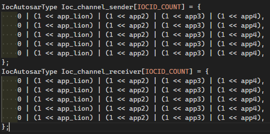

如何新增 傳輸指定 Data structure 的 IOC API：
1. 進入 osekout.oil
2. 複製 "OsIocCommunication Q2 摺疊"，貼到最後一個 OsIocCommunication Qx 以後，貼上後按照數字順序修改 Q 名稱。(e.g. Q2 複製到 Q5 以後，Q2 改名為 Q6)
3. 將複製過來的 OsIocCommunication 內部的 OsIocDataTypeRef 改成要傳輸的資料型態 (e.g. uint8, PduSignal...)，放一個就好。
4. 開啟 vscode terminal 到 OSCAR/parser，輸入 run.bat 指令執行，就能在 OSCAR/kernal/ioc.c 和 OSCAR/kernal/ioc.h 新增一組傳輸指定資料型態的 IocSend() 和 IocReceive()。

補充：
5. OsIocReceivingOsApplicationRef 代表能呼叫生成的這一支 IocReceive 的 app，OsIocSendingOsApplicationRef 代表能呼叫生成的這一支 IocSend 的 app，依照需求調整 (app_lion / app2 / app3 / app4)，放一個就好。
6. 如果希望所有 app 都能呼叫某一支 IOC API，就到 Ioc.c 中修改配置如下(每一行代表一個 OsIocCommunication 設定的 application 呼叫權限)。

